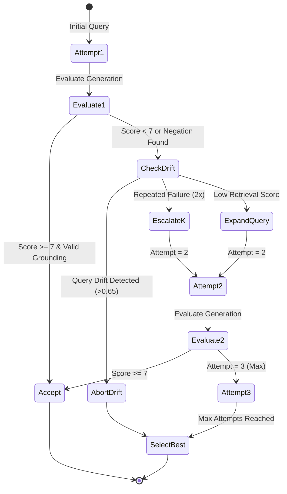

# 📐 Oncology Agentic RAG — Comprehensive System Architecture & Technical Specification

**A Production-Ready, Clinical-Grade Retrieval-Augmented Generation Architecture for Precision Oncology.**

---

## 1. Architectural Philosophy & Design Principles

The **Oncology Agentic RAG** system is engineered to solve the most critical challenges in applying Large Language Models to clinical oncology: **hallucinations, vocabulary mismatch, out-of-context drug recommendations, contraindication blindness, and privacy vulnerabilities**.

The architecture adheres to six non-negotiable principles:

1. **Evidence-First Grounding (No Autonomous Clinical Leaps)**: The system never generates oncology assertions that cannot be directly attributed to retrieved, peer-reviewed clinical guidelines or oncology literature.
2. **Deterministic Clinical Safety & Negation Detection**: Contradiction and contraindication detection must not rely solely on probabilistic LLM judgment; deterministic syntactic/semantic negation triggers actively inspect claims.
3. **HIPAA Safe Harbor Compliance by Design**: Personal Health Information (PHI) is automatically redacted at the ingestion boundary before any query enters semantic vector caches, logging streams, or vector search pipelines.
4. **Dual-Index Matryoshka Vector Elasticity**: The system supports dynamic, zero-downtime switching between 512-dimensional truncated embeddings (optimized for high concurrency and constrained RAM) and 768-dimensional full embeddings (optimized for maximum recall).
5. **State-Machine Resilience & Fast Failover**: Every network call, model inference, and vector lookup is guarded by timeouts, circuit breakers, and deterministic fallback responses to guarantee high availability.
6. **Transparent Explainability & Calibrated Confidence**: Every generated response is accompanied by extracted supporting sentence quotes, clinical reasoning traces, and a multi-factor calibrated confidence score.

---

## 2. End-to-End System Dataflow & Pipeline Architecture

```mermaid
flowchart TD
    subgraph ClientLayer ["Client & Interface Layer"]
        CLI[Interactive CLI Dashboard\napp.py]
        WebUI[Glassmorphism Web App\nfrontend/index.html]
        APIClient[External EHR / REST Client]
    end

    subgraph IngestionSec ["1. Ingestion & Security Guardrails"]
        Gateway[Flask REST / WSGI Server\nserver.py / wsgi.py]
        Auth[API Key & RBAC Validator\nmodules/security/auth.py]
        RateLimit[Sliding-Window Rate Limiter\nmodules/security/rate_limiter.py]
        PHIScrub[HIPAA Safe Harbor PHI Redactor\nmodules/security/phi_scrubber.py]
        Guardrails[Prompt Injection & XSS Guardrails\nmodules/security/guardrails.py]
    end

    subgraph CacheLayer ["2. Semantic Acceleration Layer"]
        SemCache{Semantic Vector Cache\nmodules/agent/semantic_cache.py\nThreshold >= 0.96}
        CacheHit[Instant Sub-10ms Cached Payload]
    end

    subgraph PreRetrieval ["3. Pre-Retrieval Optimization (LAQA)"]
        LAQA[Language-Aware Query Analyzer\nmodules/laqa/laqa.py]
        Classifier[Intent & Query Type Classifier]
        Biomarkers[Precision Oncology Entity & Drug Mapper]
        Expander[Domain-Bounded Query Expander\nFast-Fail 2.5s Timeout]
    end

    subgraph HybridSearch ["4. Dual-Index Hybrid Retrieval & Reranking"]
        Router{Active DB Router\nbackend/settings.py}
        MRLStore[(MRL 512-dim FAISS + BM25\nbackend/database/mrl)]
        FullStore[(Full 768-dim FAISS + BM25\nbackend/database/full)]
        DenseSearch[Dense Vector Search\nNormalized Dot Product]
        SparseSearch[Sparse BM25 Keyword Search]
        Fusion[Intent-Adaptive Weight Fusion]
        SemanticBoost[Entity & Section Boosting Engine]
        Reranker[CrossEncoder Neural Reranker\nBAAI/bge-reranker-large]
    end

    subgraph GenerationLoop ["5. Agent Controller & Evaluator Retry Loop"]
        Compressor[Context Compression & Token Budgeting]
        Generator[MedGemma Clinical Generator\nCircuit-Breaker Guarded]
        Evaluator[Multi-Metric Response Evaluator\nmodules/agent/evaluator.py]
        NegationCheck[Clinical Negation & Contraindication Detector\nmodules/clinical/negation_detector.py]
        StateMachine{Decision Engine:\nAccept / Retry / Drift Abort}
        MemoryStore[Attempt History & Drift Memory]
    end

    subgraph XAILayer ["6. Explainable AI & Observability"]
        SentenceExtract[Supporting Sentence Extractor]
        ConfCalibrate[Calibrated Confidence Calculator]
        ReasoningSynth[Clinical Reasoning Synthesizer\nThought-Leak Filtered]
        Telemetry[Prometheus Collector & Health Probes\n/metrics | /health]
        JSONLogger[Structured JSON Logger]
    end

    %% Wiring
    CLI & WebUI & APIClient --> Gateway
    Gateway --> Auth --> RateLimit --> PHIScrub --> Guardrails
    Guardrails --> SemCache
    SemCache -- Cache Hit --> CacheHit --> Gateway
    SemCache -- Cache Miss --> LAQA
    LAQA --> Classifier --> Biomarkers --> Expander
    Expander --> Router
    Router -- MRL Enabled --> MRLStore
    Router -- Full Resolution --> FullStore
    MRLStore & FullStore --> DenseSearch & SparseSearch
    DenseSearch & SparseSearch --> Fusion --> SemanticBoost --> Reranker
    Reranker --> Compressor --> Generator --> Evaluator --> NegationCheck --> StateMachine
    StateMachine -- Retry Needed (Att < 3) --> MemoryStore --> Expander
    StateMachine -- Accepted / Max Att --> SentenceExtract & ConfCalibrate & ReasoningSynth
    SentenceExtract & ConfCalibrate & ReasoningSynth --> Gateway
    Gateway -.-> Telemetry & JSONLogger
```

---

## 3. Modular Component Deep Dives

### 3.1 Security, Privacy & Ingestion Layer (`backend/modules/security/`)

#### 1. Authentication & Role-Based Access Control (`auth.py`)
- Enforces Bearer token and `X-API-Key` validation.
- Configures three distinct roles:
  - `viewer`: Read-only queries and SSE streaming.
  - `analyst`: Query submission, benchmark evaluation, and metric exports.
  - `admin`: Dynamic runtime reconfiguration (`POST /settings/update`), index re-building, and cache purging.
- Non-breaking backward compatibility: When no keys are configured in development, requests pass with developer role defaults.

#### 2. HIPAA Safe Harbor PHI Redaction Engine (`phi_scrubber.py`)
- Automatically redacts 18 HIPAA Safe Harbor direct and quasi-identifiers before logging, caching, or retrieval:
  - **Medical Record Numbers (MRN)**: Detected via clinical regex patterns (`MRN-123456`, `ID #987654`).
  - **Patient Names**: Titular and contextual name detection (`Patient John Doe`, `Mr. Smith`).
  - **Dates**: Full birth dates, admission dates, and timestamps (`12/04/1965`, `1985-02-14`).
  - **Contact Info & SSN**: Phone numbers, emails, and social security formats.
- Guarantees that neither vector embeddings nor structured logs persist unredacted patient identifiers.

#### 3. Security Guardrails & Prompt Injection Sanitizer (`guardrails.py`)
- Defends against adversarial prompt injections (e.g., `"ignore previous instructions"`, `"system override"`, `"jailbreak"`).
- Rejects XSS and script tags (`<script>`, `javascript:`, `eval()`).
- Limits query lengths to 1,500 characters to prevent buffer and memory denial-of-service.

#### 4. Sliding-Window Rate Limiter (`rate_limiter.py`)
- Thread-safe, in-memory sliding window rate limiter.
- Default threshold: 60 requests per minute per IP address.
- Returns HTTP 429 (`Too Many Requests`) with a standardized JSON error payload when thresholds are breached.

---

### 3.2 Sub-10ms Semantic Vector Cache (`backend/modules/agent/semantic_cache.py`)

- **Objective**: Eliminate LLM and retrieval latency for duplicate or semantically identical queries.
- **Mechanism**:
  1. Incoming query is PHI-scrubbed.
  2. Embeddings are generated using `get_mrl_embedding(clean_query)` (512-dim).
  3. Cosine similarity is computed against in-memory cached vectors:
     $$\text{Sim}(q, c_i) = \mathbf{q} \cdot \mathbf{c}_i \quad (\text{since } \|\mathbf{q}\|_2 = \|\mathbf{c}_i\|_2 = 1.0)$$
  4. If $\max_i \text{Sim}(q, c_i) \ge 0.96$, the cached payload is returned immediately with `"semantic_cache_hit": true` and `<10\text{ms}` latency.
- **Eviction Policy**: Thread-safe FIFO/LRU eviction capped at 500 query vectors.
- **Privacy Assurance**: Queries stored in cache are strictly PHI-redacted.

---

### 3.3 Language-Aware Query Analyzer (LAQA) (`backend/modules/laqa/laqa.py`)

Pre-retrieval query optimization bridges the terminology gap between informal clinical questions and formal medical journal/guideline documents.

#### 1. Intent Classification
Classifies the clinical intent into five primary operational classes:
- `factual`: Definition, staging, epidemiology, or diagnostic criteria.
- `clinical_guidance`: First-line, second-line, or adjuvant treatment protocols.
- `analytical`: Drug or therapy comparisons (e.g., Immunotherapy vs Chemotherapy).
- `outcome_analysis`: Prognostic estimates, OS (Overall Survival), PFS (Progression-Free Survival).
- `research`: Clinical trial criteria, Phase I–III evidence.

#### 2. Oncology Entity & Biomarker Expansion
Maintains an expert clinical dictionary mapping oncology abbreviations, brand names, and genomic biomarkers to their comprehensive medical descriptors:
- `EGFR`: Exon 19 deletion, L858R, T790M, Osimertinib (Tagrisso).
- `KRAS G12C`: Sotorasib, Adagrasib, small-molecule GTPase inhibitor.
- `BRAF V600E`: Dabrafenib, Trametinib, MEK inhibitor combination.
- `MSI-H / dMMR`: Microsatellite Instability High, Pembrolizumab, Nivolumab.
- `ADC`: Antibody-Drug Conjugate, Trastuzumab Deruxtecan (Enhertu), T-DM1.

#### 3. Bounded LLM Expansion with Fast-Fail Timeout
For complex analytical questions, LAQA invokes a bounded LLM prompt to add up to 8 domain-specific keywords. To prevent pipeline stalls when local Ollama instances are under heavy load, the expansion call enforces a strict **2.5-second timeout**, gracefully falling back to deterministic keyword expansion if latency spikes.

---

### 3.4 Dual-Index Hybrid Retrieval & Reranking (`backend/modules/retrieval/`)

#### 1. Dynamic Vector Store Routing
The system supports two distinct vector databases, selectable via `settings.py` without requiring server restarts:
- **MRL Mode (`backend/database/mrl/`)**: 512-dimensional FAISS `IndexFlatIP` index with L2 unit-normalized vectors. Delivers 33.3% memory savings and faster dot-product search.
- **Full Resolution Mode (`backend/database/full/`)**: 768-dimensional FAISS index. Maximizes semantic detail.

#### 2. Adaptive Hybrid Score Fusion
Candidates are retrieved simultaneously via dense FAISS search and sparse BM25 keyword matching. Scores are normalized to $[0, 1]$ and fused using intent-specific weights:
$$\text{Score}_{\text{base}}(d) = w_{\text{dense}} \cdot S_{\text{FAISS}}(d) + w_{\text{sparse}} \cdot S_{\text{BM25}}(d)$$

| Query Intent | Dense Weight ($w_{\text{dense}}$) | Sparse Weight ($w_{\text{sparse}}$) | Rationale |
| :--- | :---: | :---: | :--- |
| `definition` | 0.70 | 0.30 | Prioritize broad semantic conceptual matching. |
| `list` / `ranking` | 0.35 | 0.65 | Exact keyword matches are crucial for enumeration. |
| `clinical_guidance` | 0.50 | 0.50 | Balanced semantic understanding and specific drug names. |
| `factual` (Default) | 0.40 | 0.60 | High keyword precision ensures correct biomarker targeting. |

#### 3. Multi-Factor Semantic Boosting
To reward clinically relevant passages and suppress statistical noise, the fused score is adjusted:
$$\text{Score}_{\text{final}}(d) = \text{Score}_{\text{base}}(d) + \Delta_{\text{entity}} + \Delta_{\text{section}} + \Delta_{\text{def}} + \Delta_{\text{meta}} - \Delta_{\text{noise}}$$
- **Entity Boost ($\Delta_{\text{entity}} = +0.05$)**: Awarded when query drug or gene names appear directly in the chunk text.
- **Section Alignment ($\Delta_{\text{section}} = +0.05$)**: Boosted if chunk header matches query category (e.g. `treatment` query matching a `Therapeutics` section).
- **Metadata Alignment ($\Delta_{\text{meta}} = +0.05$)**: Boosted when cancer types align.
- **Noise Penalty ($\Delta_{\text{noise}} = -0.08$)**: Penalizes meta-study statistical text (e.g. `"p-value"`, `"confidence interval"`, `"statistically significant"`).

#### 4. Neural Cross-Encoder Reranking
Top candidate chunks (default $K=10$) are re-scored using `BAAI/bge-reranker-large`. The Cross-Encoder evaluates the full query-document token cross-attention matrix, capturing complex token dependencies that dual-encoder bi-encoders miss.

---

### 3.5 Context Compression & Generator (`backend/modules/generator/`)

#### 1. Sentence-Boundary Context Compression
Retrieved evidence chunks are aggregated up to a character budget (default: 6,000 characters). Rather than cutting off arbitrarily mid-sentence, `compress_context()` scans backward for terminal punctuation (`.`, `?`, `!`) to ensure the LLM receives complete, grammatical clinical assertions.

#### 2. MedGemma Medical LLM Interface
- Model: `hf.co/unsloth/medgemma-1.5-4b-it-GGUF` (or local `medgemma`).
- Prompt Structure: Clinical role conditioning with explicit negative constraints ("Do NOT extrapolate or invent indications not documented in evidence").
- **Resilience Circuit Breaker**: Wraps HTTP requests to Ollama. After 3 consecutive timeouts or connection errors, the circuit trips to `OPEN`, immediately returning a deterministic clinical fallback rather than blocking downstream threads.

---

### 3.6 Deterministic Clinical Negation & Evaluator (`backend/modules/clinical/` & `agent/`)

#### 1. Deterministic Negation Detector (`ClinicalNegationDetector`)
Standard embedding similarity often scores negated statements (e.g., *"Drug X is contraindicated in Patient Group Y"*) as highly similar to positive statements (*"Drug X is recommended in Patient Group Y"*).
The `ClinicalNegationDetector` resolves this via deterministic pattern matching:
- Negation patterns: `contraindicated`, `black box warning`, `avoid in`, `do not administer`, `refractory to`, `failed to show benefit`.
- Positive assertion patterns: `is recommended`, `first-line therapy`, `standard of care`, `approved for`.
- Cross-Assertion Check: If context asserts a contraindication for an entity while the answer makes an unreserved positive recommendation, a contradiction is flagged.

#### 2. Evaluator Scoring Model
Every candidate answer is evaluated against four quantitative dimensions:
1. **Grounding Score** ($S_{\text{grounding}} \in [0, 1]$): Ratio of answer clinical assertions supported by retrieved chunks.
2. **Retrieval Relevance** ($S_{\text{retrieval}} \in [0, 1]$): Cross-Encoder score of top retrieved chunks.
3. **Answer Relevance** ($S_{\text{relevance}} \in [0, 1]$): Semantic alignment between query and response.
4. **Hallucination Risk**: Categorized as `low`, `medium`, or `high`.

If `ClinicalNegationDetector` identifies a contradiction:
- Score is penalized by up to 4.0 points on a 10-point scale.
- Hallucination risk is automatically escalated to `high`.
- Evaluator marks `action = "expand_query"` or `"increase_k"` to trigger an autonomous retry.

---

### 3.7 Agentic State Machine & Retry Loop (`backend/modules/agent/agent_controller.py`)



- **Query Drift Guard**: `memory.py` computes token similarity between the original user query and the evolved query. If divergence exceeds 65%, the retry loop terminates immediately to prevent hallucinations from spiraling.
- **Best Result Selection**: If all 3 attempts fail to exceed the threshold, the system selects the candidate with the highest composite score:
  $$\text{Composite} = 0.45 \cdot \frac{\text{Score}_{\text{eval}}}{10} + 0.30 \cdot S_{\text{retrieval}} + 0.25 \cdot S_{\text{reranker}}$$

---

### 3.8 Explainable AI (XAI) & Output Synthesis (`backend/modules/xai/explain.py`)

#### 1. Supporting Sentence Extraction
Extracts exact sentences from retrieved documents that exhibit the highest lexical and semantic overlap with the answer. Banned statistical clutter (`"et al"`, `"p-value"`, `"study design"`) is filtered out.

#### 2. Calibrated Confidence Metric
Calculates a unified confidence score $C \in [0.05, 0.95]$:
$$C = 0.30 C_{\text{eval}} + 0.30 S_{\text{retrieval}} + 0.25 S_{\text{grounding}} + 0.15 S_{\text{relevance}} - 0.30 S_{\text{contradiction}}$$
- If Hallucination Risk is `high`, $C \leftarrow C \times 0.50$.
- If Hallucination Risk is `medium`, $C \leftarrow C \times 0.80$.

#### 3. Clinical Reasoning Generation with Thought-Leak Stripping
Generates 2 to 4 concise clinical reasoning bullets explaining the pharmacological and clinical rationale. A post-processing filter strips internal LLM thinking leaks (`<thought>`, `analysis:`, `step-by-step`) and prompt echoes before delivering the response.

---

### 3.9 Observability & Diagnostics (`backend/modules/observability/`)

- **Structured JSON Logging (`logger.py`)**: All events, latencies, and security denials emit JSON with timestamps, correlation IDs, and redacted queries.
- **Prometheus Telemetry (`metrics_collector.py`)**: Real-time tracking of:
  - Query counts and error rates.
  - Latency distributions (P50, P95, P99).
  - Semantic cache hit rates.
  - Active retry attempts and fallback counts.
- **Deep Health Diagnostics (`GET /health`)**: Live readiness probe inspecting FAISS file availability, embedding dimension consistency, and live Ollama latency.

---

## 4. Latency Budget & SLA Breakdown

The system is optimized to operate under the following latency budgets for a typical 4-core CPU / single consumer GPU deployment:

| Pipeline Stage | Sub-10ms Cache Hit | Cold / Fresh Execution | 3-Attempt Retry (Worst Case) |
| :--- | :---: | :---: | :---: |
| Security, Auth & PHI Redaction | $<1\text{ ms}$ | $<2\text{ ms}$ | $<2\text{ ms}$ |
| Semantic Cache Lookup | $4\text{ ms}$ | $4\text{ ms}$ | $4\text{ ms}$ |
| LAQA Query Expansion | — | $40 - 150\text{ ms}$ | $150\text{ ms}$ |
| Hybrid Retrieval (FAISS + BM25) | — | $25 - 60\text{ ms}$ | $120\text{ ms}$ |
| CrossEncoder Reranking | — | $120 - 250\text{ ms}$ | $600\text{ ms}$ |
| MedGemma Generation | — | $800 - 1,800\text{ ms}$ | $4,500\text{ ms}$ |
| Evaluator & Negation Check | — | $20 - 40\text{ ms}$ | $90\text{ ms}$ |
| XAI Reasoning & Confidence | — | $150 - 350\text{ ms}$ | $350\text{ ms}$ |
| **Total End-to-End Latency** | **$<10\text{ ms}$** | **$1.2 - 2.7\text{ s}$** | **$5.8\text{ s}$** |

---

## 5. Failure Modes, Fallbacks & Circuit Breakers

| Failure Scenario | Detection Mechanism | Immediate Mitigation | Final System State |
| :--- | :--- | :--- | :--- |
| **Ollama Service Down** | HTTP connection refused / 500ms timeout | Generator circuit breaker trips | Returns safe clinical fallback answer with degraded confidence |
| **FAISS DLL Loading Error** | Windows AppLocker / native DLL exception | `HAS_FAISS` fallback guard | BM25 sparse keyword retriever continues serving requests |
| **Severe Query Drift** | Jaccard similarity $<0.35$ with original query | Memory drift detector | Retries abort immediately; best attempt returned |
| **Adversarial Injection** | Regex pattern match in `guardrails.py` | Query blocked before pipeline entry | HTTP 400 with security alert log |
| **Contradictory Drug Claim** | `ClinicalNegationDetector` match | Score penalized; retry triggered | Escalated retrieval or contraindication warning attached |
